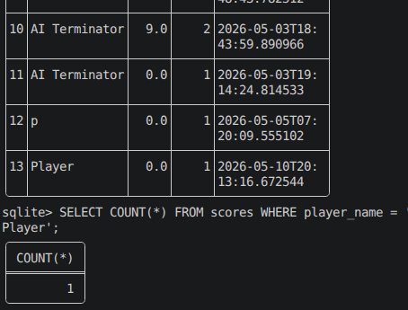

# Small Data Steward Project Based on the Snake Game

## 🎯 Objective
Build a Data Quality & Governance layer on top of the Snake game’s score database.

## Project Structure

- Define and monitor data quality rules
```bash
Core Governance Files, data_quality.py - Data Quality Engine
Purpose: Monitors and enforces data quality rules on your scores database
```
When to use:

- ✅ Daily: Run automated quality checks

- ✅ After new scores added: Verify data integrity

- ✅ Before generating reports: Ensure data is clean

- ✅ When debugging data issues: Identify rule violations

- Data Profiling
```bash
data_profiler.py - Data Profiling & Analytics
Purpose: Analyzes data patterns, statistics, and detects anomalies
```
When to use:
- ✅ Weekly: Generate data profile reports
- ✅ Understand player behavior patterns
- ✅ Find unusual scoring patterns (cheating detection)
- ✅ Capacity planning (peak hours, active players)

- Document metadata (data dictionary, lineage)
```bash
metadata_manager.py - Data Documentation
Purpose: Manages data dictionary, business glossary, and data lineage
```
When to use:

- ✅ Initial project setup: Document all tables/columns
- ✅ When adding new features: Update data dictionary
- ✅ Team onboarding: Share business glossary
- ✅ Compliance: Maintain data lineage documentation

- Profile data and detect anomalies

- Provide a simple steward dashboard
```bash
steward_dashboard.py - Web Dashboard
Purpose: Provides visual interface for monitoring data governance
```
When to use:
- ✅ Daily monitoring: Quick visual health check
- ✅ Team demos: Show data quality status
- ✅ Management reporting: Export quality metrics
- ✅ Root cause analysis: Investigate data issues

- Supporting Files
```bash
quality_rules.yaml - Rule Configuration
```
When to use:
- ✅ Adjusting quality thresholds without code changes
- ✅ Adding new rules quickly
- ✅ Different environments (dev/prod) have different rules

Usage:
```python
# Load rules from YAML instead of hardcoding
checker = DataQualityChecker()
checker.load_rules_from_yaml('quality_rules.yaml')
```

snake-game/
├── data_governance/
│   ├── __init__.py
│   ├── data_quality.py      # Quality rules engine
│   ├── metadata_manager.py  # Data dictionary & lineage
│   ├── data_profiler.py     # Data profiling & anomaly detection
│   ├── steward_dashboard.py # Flask dashboard
│   ├── quality_rules.yaml   # Configurable quality rules
│   ├── templates/
│   │   └── steward_dashboard.html
│   └── static/
│       └── dashboard.css

## 🚀 Quick Start Commands
```bash
# 1. Set up the governance layer (from project root)
cd /path/to/snake-game

# 2. Create directory structure if not exists
mkdir -p data_governance/{templates,static}

# 3. Install required packages
pip install pandas scipy pyyaml flask

# 4. Test each component individually

# Test Data Quality Checker
python -c "
from data_governance.data_quality import DataQualityChecker
checker = DataQualityChecker('scores.db')
results = checker.run_all_checks()
print(f'✅ Ran {len(results)} quality checks')
"

# Test Data Profiler
python -c "
from data_governance.data_profiler import DataProfiler
profiler = DataProfiler('scores.db')
profile = profiler.full_profile()
print(f'✅ Profiled {profile[\"basic_stats\"][\"total_records\"]} records')
"

# Test Metadata Manager
python -c "
from data_governance.metadata_manager import MetadataManager
mm = MetadataManager('scores.db')
dictionary = mm.generate_data_dictionary()
print(f'✅ Generated data dictionary for {len(dictionary)} tables')
"

# 5. Launch the full dashboard
python data_governance/steward_dashboard.py
# Open browser to http://localhost:5001
```

## User Cases
### 1. Failed player_name Check
```bash
# Inspect results of all the rules
uv run steward.py
```
INFO:data_governance.data_quality:Executing rule: completeness_player_name
✅ Ran 1 quality checks
Rule: completeness_player_name
Passed: False
Score: 92.31%
Message: Quality score: 92.31% (threshold: 95.00%) - 1 records affected
<p align="center">
  
</p>

## 1. Data Quality Rules Engine
### Setup
```bash
# 1. Create governance directory structure
mkdir -p data_governance/{templates,static}
cd data_governance

# 2. Install required packages
pip install pandas scipy pyyaml flask

# 3. Create empty files
touch __init__.py data_quality.py metadata_manager.py data_profiler.py steward_dashboard.py quality_rules.yaml
```

```python
# data_governance/data_quality.py
"""
Data Quality Rule Engine for Snake Game Scores
Monitors data quality metrics and enforces governance rules
"""

import sqlite3
import json
import logging
from datetime import datetime, timedelta
from typing import Dict, List, Any, Tuple
from dataclasses import dataclass, asdict
from enum import Enum
import pandas as pd
from pathlib import Path

# Configure logging
logging.basicConfig(level=logging.INFO)
logger = logging.getLogger(__name__)

class Severity(Enum):
    INFO = "info"
    WARNING = "warning"
    CRITICAL = "critical"

@dataclass
class QualityRule:
    """Data quality rule definition"""
    name: str
    description: str
    severity: Severity
    check_type: str  # completeness, uniqueness, consistency, accuracy, timeliness
    query: str
    threshold: float
    active: bool = True

@dataclass
class QualityResult:
    """Result of quality rule execution"""
    rule_name: str
    passed: bool
    score: float
    threshold: float
    severity: str
    message: str
    timestamp: datetime
    affected_rows: int = 0

class DataQualityChecker:
    """Main data quality monitoring system"""

    def __init__(self, db_path: str = "scores.db"):
        self.db_path = db_path
        self.quality_history_table = "quality_checks_history"
        self._init_history_table()

        # Load quality rules
        self.rules = self._load_default_rules()

    def _init_history_table(self):
        """Initialize table to store quality check history"""
        conn = sqlite3.connect(self.db_path)
        cursor = conn.cursor()
        cursor.execute(f"""
            CREATE TABLE IF NOT EXISTS {self.quality_history_table} (
                id INTEGER PRIMARY KEY AUTOINCREMENT,
                check_date TIMESTAMP DEFAULT CURRENT_TIMESTAMP,
                rule_name TEXT,
                passed BOOLEAN,
                score REAL,
                threshold REAL,
                severity TEXT,
                message TEXT,
                affected_rows INTEGER
            )
        """)
        conn.commit()
        conn.close()

    def _load_default_rules(self) -> List[QualityRule]:
        """Load default data quality rules"""
        rules = [
            QualityRule(
                name="completeness_player_name",
                description="Player name should never be NULL or empty",
                severity=Severity.CRITICAL,
                check_type="completeness",
                query="""
                    SELECT COUNT(*) as total,
                           SUM(CASE WHEN player_name IS NULL OR player_name = '' THEN 1 ELSE 0 END) as null_count
                    FROM scores
                """,
                threshold=0.95  # 95% completeness required
            ),
            QualityRule(
                name="valid_score_range",
                description="Scores should be between 0 and 10000",
                severity=Severity.WARNING,
                check_type="accuracy",
                query="""
                    SELECT COUNT(*) as total,
                           SUM(CASE WHEN score < 0 OR score > 10000 THEN 1 ELSE 0 END) as invalid_count
                    FROM scores
                """,
                threshold=0.99  # 99% scores in valid range
            ),
            QualityRule(
                name="no_negative_scores",
                description="Scores should never be negative",
                severity=Severity.CRITICAL,
                check_type="accuracy",
                query="""
                    SELECT COUNT(*) as total,
                           SUM(CASE WHEN score < 0 THEN 1 ELSE 0 END) as negative_count
                    FROM scores
                """,
                threshold=1.0  # 100% non-negative
            ),
            QualityRule(
                name="reasonable_score_increment",
                description="Score increments should be 1.5 or less (no cheating)",
                severity=Severity.WARNING,
                check_type="consistency",
                query="""
                    SELECT COUNT(*) as total,
                           SUM(CASE WHEN score - lag_score > 1.6 THEN 1 ELSE 0 END) as suspicious_increments
                    FROM (
                        SELECT score, LAG(score) OVER (ORDER BY timestamp) as lag_score
                        FROM scores
                        WHERE player_name = 'human'
                    )
                """,
                threshold=0.95
            ),
            QualityRule(
                name="unique_player_session",
                description="No duplicate scores from same player within 1 second",
                severity=Severity.WARNING,
                check_type="uniqueness",
                query="""
                    SELECT COUNT(*) as total,
                           SUM(CASE WHEN dup_count > 1 THEN dup_count - 1 ELSE 0 END) as duplicate_count
                    FROM (
                        SELECT player_name, score, timestamp,
                               COUNT(*) OVER (PARTITION BY player_name, score, strftime('%Y-%m-%d %H:%M:%S', timestamp)) as dup_count
                        FROM scores
                    )
                """,
                threshold=0.98
            ),
            QualityRule(
                name="freshness_24h",
                description="New scores should arrive within last 24 hours",
                severity=Severity.WARNING,
                check_type="timeliness",
                query="""
                    SELECT COUNT(*) as total,
                           SUM(CASE WHEN julianday('now') - julianday(timestamp) > 1 THEN 1 ELSE 0 END) as old_records
                    FROM scores
                """,
                threshold=0.90  # 90% of data should be fresh
            ),
            QualityRule(
                name="player_name_length",
                description="Player names should be between 1 and 20 characters",
                severity=Severity.INFO,
                check_type="consistency",
                query="""
                    SELECT COUNT(*) as total,
                           SUM(CASE WHEN LENGTH(player_name) < 1 OR LENGTH(player_name) > 20 THEN 1 ELSE 0 END) as invalid_length
                    FROM scores
                """,
                threshold=0.95
            ),
            QualityRule(
                name="score_not_too_high",
                description="Scores above 5000 are suspicious and may indicate cheating",
                severity=Severity.WARNING,
                check_type="accuracy",
                query="""
                    SELECT COUNT(*) as total,
                           SUM(CASE WHEN score > 5000 THEN 1 ELSE 0 END) as high_scores
                    FROM scores
                """,
                threshold=0.95
            )
        ]
        return rules

    def load_rules_from_yaml(self, yaml_path: str):
        """Load quality rules from YAML configuration"""
        import yaml
        with open(yaml_path, 'r') as f:
            rules_config = yaml.safe_load(f)

        self.rules = []
        for rule_config in rules_config['quality_rules']:
            self.rules.append(QualityRule(
                name=rule_config['name'],
                description=rule_config['description'],
                severity=Severity[rule_config['severity'].upper()],
                check_type=rule_config['check_type'],
                query=rule_config['query'],
                threshold=rule_config['threshold'],
                active=rule_config.get('active', True)
            ))

    def execute_rule(self, rule: QualityRule) -> QualityResult:
        """Execute a single quality rule"""
        if not rule.active:
            return QualityResult(
                rule_name=rule.name,
                passed=True,
                score=1.0,
                threshold=rule.threshold,
                severity=rule.severity.value,
                message="Rule inactive - skipped",
                timestamp=datetime.now()
            )

        try:
            conn = sqlite3.connect(self.db_path)
            df = pd.read_sql_query(rule.query, conn)
            conn.close()

            if len(df) == 0:
                score = 1.0
                affected_rows = 0
                passed = score >= rule.threshold
            else:
                total = df.iloc[0]['total']
                invalid = df.iloc[0].get('null_count', df.iloc[0].get('invalid_count',
                         df.iloc[0].get('negative_count', df.iloc[0].get('suspicious_increments',
                         df.iloc[0].get('duplicate_count', df.iloc[0].get('old_records',
                         df.iloc[0].get('invalid_length', df.iloc[0].get('high_scores', 0))))))))

                affected_rows = invalid if 'invalid' in locals() else 0
                valid = total - invalid if total > 0 else 0
                score = valid / total if total > 0 else 1.0
                passed = score >= rule.threshold

            message = f"Quality score: {score:.2%} (threshold: {rule.threshold:.2%})"
            if not passed:
                message += f" - {affected_rows} records affected"

            return QualityResult(
                rule_name=rule.name,
                passed=passed,
                score=score,
                threshold=rule.threshold,
                severity=rule.severity.value,
                message=message,
                timestamp=datetime.now(),
                affected_rows=affected_rows
            )

        except Exception as e:
            logger.error(f"Error executing rule {rule.name}: {e}")
            return QualityResult(
                rule_name=rule.name,
                passed=False,
                score=0.0,
                threshold=rule.threshold,
                severity=rule.severity.value,
                message=f"Error: {str(e)}",
                timestamp=datetime.now()
            )

    def run_all_checks(self) -> List[QualityResult]:
        """Execute all active quality rules"""
        results = []

        for rule in self.rules:
            logger.info(f"Executing rule: {rule.name}")
            result = self.execute_rule(rule)
            results.append(result)

            # Store to history
            self._store_result(result)

            # Log alert for critical failures
            if not result.passed and result.severity == Severity.CRITICAL.value:
                self._send_alert(result)

        return results

    def _store_result(self, result: QualityResult):
        """Store quality check result in history"""
        conn = sqlite3.connect(self.db_path)
        cursor = conn.cursor()
        cursor.execute(f"""
            INSERT INTO {self.quality_history_table}
            (rule_name, passed, score, threshold, severity, message, affected_rows, check_date)
            VALUES (?, ?, ?, ?, ?, ?, ?, ?)
        """, (
            result.rule_name, result.passed, result.score,
            result.threshold, result.severity, result.message,
            result.affected_rows, result.timestamp
        ))
        conn.commit()
        conn.close()

    def _send_alert(self, result: QualityResult):
        """Send alert for critical quality failures"""
        # Can integrate with email, Slack, or logging system
        alert_msg = f"""
        ⚠️ DATA QUALITY ALERT ⚠️
        Rule: {result.rule_name}
        Severity: {result.severity}
        Score: {result.score:.2%} (Threshold: {result.threshold:.2%})
        Message: {result.message}
        Time: {result.timestamp}
        """
        logger.critical(alert_msg)

        # Optionally send to Slack webhook
        # self._send_slack_alert(alert_msg)

    def get_quality_summary(self, days: int = 7) -> Dict:
        """Get quality summary for last N days"""
        conn = sqlite3.connect(self.db_path)

        query = f"""
            SELECT
                rule_name,
                severity,
                COUNT(*) as total_checks,
                SUM(CASE WHEN passed = 1 THEN 1 ELSE 0 END) as passed_checks,
                AVG(score) as avg_score,
                MIN(score) as min_score,
                MAX(score) as max_score
            FROM {self.quality_history_table}
            WHERE check_date >= datetime('now', '-{days} days')
            GROUP BY rule_name, severity
            ORDER BY avg_score ASC
        """

        df = pd.read_sql_query(query, conn)
        conn.close()

        overall_pass_rate = df['passed_checks'].sum() / df['total_checks'].sum() if len(df) > 0 else 0

        return {
            'total_rules': len(df),
            'overall_pass_rate': overall_pass_rate,
            'critical_failures': len(df[df['severity'] == Severity.CRITICAL.value]),
            'rules_summary': df.to_dict('records'),
            'trend': self._calculate_trend()
        }

    def _calculate_trend(self) -> str:
        """Calculate quality trend"""
        conn = sqlite3.connect(self.db_path)
        query = f"""
            SELECT
                date(check_date) as check_day,
                AVG(score) as daily_avg_score
            FROM {self.quality_history_table}
            WHERE check_date >= datetime('now', '-7 days')
            GROUP BY date(check_date)
            ORDER BY check_day
        """
        df = pd.read_sql_query(query, conn)
        conn.close()

        if len(df) >= 2:
            if df['daily_avg_score'].iloc[-1] > df['daily_avg_score'].iloc[0]:
                return "improving"
            elif df['daily_avg_score'].iloc[-1] < df['daily_avg_score'].iloc[0]:
                return "declining"
        return "stable"
```

### Quick check
```bash
python -c "from data_governance.data_quality import DataQualityChecker; checker=DataQualityChecker(); checker.run_all_checks()"
```

## 2. Metadata Manager (Data Dictonary & Lineage)
```python
# data_governance/metadata_manager.py
"""
Metadata management for Snake Game data assets
Tracks data dictionary, lineage, and business glossary
"""

import sqlite3
import json
from datetime import datetime
from typing import Dict, List, Any, Optional
from dataclasses import dataclass, asdict
from pathlib import Path

@dataclass
class DataColumn:
    """Data column metadata"""
    name: str
    data_type: str
    description: str
    business_name: str
    is_nullable: bool
    is_primary_key: bool
    sample_values: List[str]
    constraints: List[str]

@dataclass
class DataTable:
    """Data table metadata"""
    name: str
    description: str
    business_name: str
    owner: str
    source_system: str
    update_frequency: str
    columns: List[DataColumn]
    row_count: int
    last_updated: datetime

@dataclass
class DataLineage:
    """Data lineage information"""
    source_table: str
    target_table: str
    transformation: str
    frequency: str
    dependencies: List[str]

class MetadataManager:
    """Manage data metadata, dictionary, and lineage"""

    def __init__(self, db_path: str = "scores.db"):
        self.db_path = db_path
        self.metadata_db = "data_governance_metadata.db"
        self._init_metadata_tables()

    def _init_metadata_tables(self):
        """Initialize metadata storage tables"""
        conn = sqlite3.connect(self.metadata_db)
        cursor = conn.cursor()

        # Data dictionary table
        cursor.execute("""
            CREATE TABLE IF NOT EXISTS data_dictionary (
                id INTEGER PRIMARY KEY AUTOINCREMENT,
                table_name TEXT,
                column_name TEXT,
                data_type TEXT,
                description TEXT,
                business_name TEXT,
                is_nullable BOOLEAN,
                is_primary_key BOOLEAN,
                sample_values TEXT,
                constraints TEXT,
                last_updated TIMESTAMP DEFAULT CURRENT_TIMESTAMP
            )
        """)

        # Lineage tracking
        cursor.execute("""
            CREATE TABLE IF NOT EXISTS data_lineage (
                id INTEGER PRIMARY KEY AUTOINCREMENT,
                source_table TEXT,
                target_table TEXT,
                transformation TEXT,
                frequency TEXT,
                dependencies TEXT,
                created_at TIMESTAMP DEFAULT CURRENT_TIMESTAMP
            )
        """)

        # Business glossary
        cursor.execute("""
            CREATE TABLE IF NOT EXISTS business_glossary (
                term TEXT PRIMARY KEY,
                definition TEXT,
                category TEXT,
                owner TEXT,
                created_at TIMESTAMP DEFAULT CURRENT_TIMESTAMP
            )
        """)

        conn.commit()
        conn.close()

    def generate_data_dictionary(self) -> Dict:
        """Generate complete data dictionary from scores database"""
        conn = sqlite3.connect(self.db_path)
        cursor = conn.cursor()

        # Get table info
        cursor.execute("SELECT name FROM sqlite_master WHERE type='table' AND name='scores'")
        tables = cursor.fetchall()

        data_dictionary = {}

        for table in tables:
            table_name = table[0]
            cursor.execute(f"PRAGMA table_info({table_name})")
            columns = cursor.fetchall()

            # Get sample values
            cursor.execute(f"SELECT * FROM {table_name} LIMIT 5")
            samples = cursor.fetchall()

            table_dict = {
                'name': table_name,
                'description': 'Snake game scores table storing player performance data',
                'business_name': 'Player Score History',
                'owner': 'Data Engineering Team',
                'source_system': 'Snake Game Application',
                'update_frequency': 'Real-time (per game completion)',
                'row_count': cursor.execute(f"SELECT COUNT(*) FROM {table_name}").fetchone()[0],
                'last_updated': datetime.now(),
                'columns': []
            }

            for col in columns:
                col_id, col_name, col_type, not_null, default, pk = col

                # Get sample values for this column
                cursor.execute(f"SELECT DISTINCT {col_name} FROM {table_name} LIMIT 3")
                sample_vals = [str(row[0]) for row in cursor.fetchall() if row[0] is not None]

                column_dict = {
                    'name': col_name,
                    'data_type': col_type,
                    'description': self._get_column_description(col_name),
                    'business_name': self._get_business_name(col_name),
                    'is_nullable': not bool(not_null),
                    'is_primary_key': bool(pk),
                    'sample_values': sample_vals,
                    'constraints': self._get_column_constraints(col_name, not_null, pk)
                }

                table_dict['columns'].append(column_dict)

                # Store in metadata DB
                self._store_column_metadata(table_name, column_dict)

            data_dictionary[table_name] = table_dict

        conn.close()
        return data_dictionary

    def _get_column_description(self, column_name: str) -> str:
        """Get human-readable column description"""
        descriptions = {
            'id': 'Unique identifier for each game session',
            'player_name': 'Name of the player who completed the game',
            'score': 'Final score achieved by the player (1.5 points per food collected)',
            'timestamp': 'Date and time when the game ended',
            'game_version': 'Version of the game application',
            'deduplicated': 'Flag indicating if this record has been deduplicated by ETL pipeline'
        }
        return descriptions.get(column_name, f'Field containing {column_name} data')

    def _get_business_name(self, column_name: str) -> str:
        """Get business-friendly column name"""
        business_names = {
            'id': 'Game Session ID',
            'player_name': 'Player Identifier',
            'score': 'Game Score',
            'timestamp': 'Game Completion Timestamp',
            'game_version': 'Application Version',
            'deduplicated': 'Deduplication Status'
        }
        return business_names.get(column_name, column_name.replace('_', ' ').title())

    def _get_column_constraints(self, column_name: str, not_null: bool, pk: bool) -> List[str]:
        """Get business constraints for column"""
        constraints = []
        if pk:
            constraints.append('Primary Key - Unique identifier')
        if not_null:
            constraints.append('NOT NULL - Required field')
        if column_name == 'score':
            constraints.append('Range: 0 to 10000')
        if column_name == 'player_name':
            constraints.append('Length: 1-20 characters')
        if column_name == 'timestamp':
            constraints.append('Must be valid datetime, cannot be future dated')
        return constraints

    def _store_column_metadata(self, table_name: str, column: Dict):
        """Store column metadata in metadata database"""
        conn = sqlite3.connect(self.metadata_db)
        cursor = conn.cursor()
        cursor.execute("""
            INSERT OR REPLACE INTO data_dictionary
            (table_name, column_name, data_type, description, business_name,
             is_nullable, is_primary_key, sample_values, constraints, last_updated)
            VALUES (?, ?, ?, ?, ?, ?, ?, ?, ?, ?)
        """, (
            table_name, column['name'], column['data_type'], column['description'],
            column['business_name'], column['is_nullable'], column['is_primary_key'],
            json.dumps(column['sample_values']), json.dumps(column['constraints']),
            datetime.now()
        ))
        conn.commit()
        conn.close()

    def define_lineage(self, lineage: DataLineage):
        """Define data lineage for transformation pipelines"""
        conn = sqlite3.connect(self.metadata_db)
        cursor = conn.cursor()
        cursor.execute("""
            INSERT INTO data_lineage (source_table, target_table, transformation, frequency, dependencies)
            VALUES (?, ?, ?, ?, ?)
        """, (
            lineage.source_table, lineage.target_table, lineage.transformation,
            lineage.frequency, json.dumps(lineage.dependencies)
        ))
        conn.commit()
        conn.close()

    def get_lineage(self, table_name: str) -> List[Dict]:
        """Get lineage information for a table"""
        conn = sqlite3.connect(self.metadata_db)
        cursor = conn.cursor()
        cursor.execute("""
            SELECT source_table, target_table, transformation, frequency, dependencies
            FROM data_lineage
            WHERE source_table = ? OR target_table = ?
        """, (table_name, table_name))

        rows = cursor.fetchall()
        conn.close()

        return [
            {
                'source_table': row[0],
                'target_table': row[1],
                'transformation': row[2],
                'frequency': row[3],
                'dependencies': json.loads(row[4])
            }
            for row in rows
        ]

    def add_business_term(self, term: str, definition: str, category: str, owner: str):
        """Add term to business glossary"""
        conn = sqlite3.connect(self.metadata_db)
        cursor = conn.cursor()
        cursor.execute("""
            INSERT OR REPLACE INTO business_glossary (term, definition, category, owner)
            VALUES (?, ?, ?, ?)
        """, (term, definition, category, owner))
        conn.commit()
        conn.close()

    def get_business_glossary(self) -> List[Dict]:
        """Retrieve all business glossary terms"""
        conn = sqlite3.connect(self.metadata_db)
        cursor = conn.cursor()
        cursor.execute("SELECT term, definition, category, owner, created_at FROM business_glossary")
        rows = cursor.fetchall()
        conn.close()

        return [
            {
                'term': row[0],
                'definition': row[1],
                'category': row[2],
                'owner': row[3],
                'created_at': row[4]
            }
            for row in rows
        ]

    def export_metadata(self, format: str = 'json') -> str:
        """Export metadata in JSON or Markdown format"""
        data_dict = self.generate_data_dictionary()
        lineage = self.get_lineage('scores')
        glossary = self.get_business_glossary()

        metadata_export = {
            'data_dictionary': data_dict,
            'lineage': lineage,
            'business_glossary': glossary,
            'export_timestamp': datetime.now().isoformat()
        }

        if format == 'json':
            output_file = f"metadata_export_{datetime.now().strftime('%Y%m%d')}.json"
            with open(output_file, 'w') as f:
                json.dump(metadata_export, f, indent=2, default=str)
            return output_file

        elif format == 'markdown':
            return self._export_to_markdown(metadata_export)

        return json.dumps(metadata_export, indent=2, default=str)

    def _export_to_markdown(self, metadata: Dict) -> str:
        """Export metadata as Markdown documentation"""
        md = "# Snake Game Data Governance Documentation\n\n"

        # Data Dictionary
        md += "## 📊 Data Dictionary\n\n"
        for table_name, table_info in metadata['data_dictionary'].items():
            md += f"### Table: {table_name} ({table_info['business_name']})\n\n"
            md += f"**Description:** {table_info['description']}\n\n"
            md += f"**Owner:** {table_info['owner']}\n\n"
            md += f"**Update Frequency:** {table_info['update_frequency']}\n\n"
            md += f"**Row Count:** {table_info['row_count']}\n\n"

            md += "| Column | Type | Description | Business Name | Constraints |\n"
            md += "|--------|------|-------------|---------------|-------------|\n"

            for col in table_info['columns']:
                constraints = "; ".join(col['constraints'])
                md += f"| {col['name']} | {col['data_type']} | {col['description']} | {col['business_name']} | {constraints} |\n"
            md += "\n---\n\n"

        # Lineage
        md += "## 🔄 Data Lineage\n\n"
        for lineage in metadata['lineage']:
            md += f"**{lineage['source_table']}** → **{lineage['target_table']}**\n"
            md += f"- Transformation: {lineage['transformation']}\n"
            md += f"- Frequency: {lineage['frequency']}\n"
            md += f"- Dependencies: {', '.join(lineage['dependencies'])}\n\n"

        # Business Glossary
        md += "## 📖 Business Glossary\n\n"
        md += "| Term | Definition | Category | Owner |\n"
        md += "|------|------------|----------|-------|\n"
        for term in metadata['business_glossary']:
            md += f"| {term['term']} | {term['definition']} | {term['category']} | {term['owner']} |\n"

        output_file = f"data_governance_docs_{datetime.now().strftime('%Y%m%d')}.md"
        with open(output_file, 'w') as f:
            f.write(md)

        return output_file
```

## 3. Data Profiler & Anomaly Detection
```python
# data_governance/data_profiler.py
"""
Data profiling and anomaly detection for score database
"""

import sqlite3
import pandas as pd
import numpy as np
from datetime import datetime, timedelta
from typing import Dict, List, Any, Tuple
from scipy import stats
import json
import logging

logging.basicConfig(level=logging.INFO)
logger = logging.getLogger(__name__)

class DataProfiler:
    """Profile data and detect anomalies"""

    def __init__(self, db_path: str = "scores.db"):
        self.db_path = db_path
        self.profile_history_table = "data_profiles"
        self.anomaly_table = "detected_anomalies"
        self._init_tables()

    def _init_tables(self):
        """Initialize profiling and anomaly tables"""
        conn = sqlite3.connect(self.db_path)
        cursor = conn.cursor()

        cursor.execute(f"""
            CREATE TABLE IF NOT EXISTS {self.profile_history_table} (
                id INTEGER PRIMARY KEY AUTOINCREMENT,
                profile_date TIMESTAMP DEFAULT CURRENT_TIMESTAMP,
                total_records INTEGER,
                unique_players INTEGER,
                avg_score REAL,
                median_score REAL,
                std_dev_score REAL,
                min_score INTEGER,
                max_score INTEGER,
                score_percentiles TEXT,
                hourly_activity TEXT,
                top_players TEXT
            )
        """)

        cursor.execute(f"""
            CREATE TABLE IF NOT EXISTS {self.anomaly_table} (
                id INTEGER PRIMARY KEY AUTOINCREMENT,
                detection_date TIMESTAMP DEFAULT CURRENT_TIMESTAMP,
                anomaly_type TEXT,
                description TEXT,
                severity TEXT,
                affected_records TEXT,
                resolution_status TEXT DEFAULT 'open'
            )
        """)

        conn.commit()
        conn.close()

    def full_profile(self) -> Dict:
        """Generate complete data profile"""
        conn = sqlite3.connect(self.db_path)

        # Basic statistics
        df = pd.read_sql_query("SELECT * FROM scores", conn)

        profile = {
            'timestamp': datetime.now().isoformat(),
            'basic_stats': self._basic_statistics(df),
            'score_distribution': self._score_distribution(df),
            'temporal_patterns': self._temporal_analysis(conn),
            'player_behavior': self._player_analysis(df),
            'data_quality_metrics': self._data_quality_metrics(df),
            'correlations': self._calculate_correlations(df)
        }

        # Store profile
        self._store_profile(profile)
        conn.close()

        return profile

    def _basic_statistics(self, df: pd.DataFrame) -> Dict:
        """Calculate basic statistical metrics"""
        return {
            'total_records': len(df),
            'unique_players': df['player_name'].nunique(),
            'date_range': {
                'start': df['timestamp'].min(),
                'end': df['timestamp'].max(),
                'days_span': (df['timestamp'].max() - df['timestamp'].min()).days if len(df) > 0 else 0
            },
            'score_stats': {
                'mean': float(df['score'].mean()),
                'median': float(df['score'].median()),
                'std': float(df['score'].std()),
                'min': int(df['score'].min()),
                'max': int(df['score'].max()),
                'q1': float(df['score'].quantile(0.25)),
                'q3': float(df['score'].quantile(0.75)),
                'iqr': float(df['score'].quantile(0.75) - df['score'].quantile(0.25))
            },
            'missing_values': {
                'player_name': int(df['player_name'].isna().sum()),
                'score': int(df['score'].isna().sum()),
                'timestamp': int(df['timestamp'].isna().sum())
            }
        }

    def _score_distribution(self, df: pd.DataFrame) -> Dict:
        """Analyze score distribution"""
        scores = df['score']

        # Create bins
        bins = [0, 50, 100, 200, 500, 1000, 5000, 10000]
        labels = ['0-50', '51-100', '101-200', '201-500', '501-1000', '1001-5000', '5001+']

        df['score_range'] = pd.cut(scores, bins=bins, labels=labels)
        distribution = df['score_range'].value_counts().to_dict()

        # Detect outliers using IQR method
        Q1 = scores.quantile(0.25)
        Q3 = scores.quantile(0.75)
        IQR = Q3 - Q1
        outlier_threshold = Q3 + 1.5 * IQR
        outliers = scores[scores > outlier_threshold]

        return {
            'score_ranges': {str(k): int(v) for k, v in distribution.items()},
            'outliers': {
                'count': len(outliers),
                'percentage': (len(outliers) / len(df)) * 100 if len(df) > 0 else 0,
                'values': outliers.head(10).tolist()
            },
            'skewness': float(scores.skew()) if len(df) > 1 else 0,
            'kurtosis': float(scores.kurtosis()) if len(df) > 1 else 0
        }

    def _temporal_analysis(self, conn: sqlite3.Connection) -> Dict:
        """Analyze temporal patterns"""
        query = """
            SELECT
                strftime('%Y-%m-%d', timestamp) as game_date,
                strftime('%H:00', timestamp) as game_hour,
                COUNT(*) as games_played,
                AVG(score) as avg_score,
                COUNT(DISTINCT player_name) as unique_players
            FROM scores
            GROUP BY game_date, game_hour
            ORDER BY game_date DESC
        """

        df = pd.read_sql_query(query, conn)

        if len(df) == 0:
            return {}

        # Peak hours
        hourly_activity = df.groupby('game_hour')['games_played'].sum().sort_values(ascending=False)

        # Recent trends (last 7 days)
        recent = df[df['game_date'] >= (datetime.now() - timedelta(days=7)).strftime('%Y-%m-%d')]

        return {
            'peak_hours': hourly_activity.head(5).to_dict(),
            'total_games_last_7_days': len(recent),
            'avg_score_trend': recent.groupby('game_date')['avg_score'].mean().tail(7).to_dict(),
            'best_day_of_week': self._analyze_day_of_week(df)
        }

    def _analyze_day_of_week(self, df: pd.DataFrame) -> Dict:
        """Analyze patterns by day of week"""
        df['weekday'] = pd.to_datetime(df['game_date']).dt.day_name()
        weekday_stats = df.groupby('weekday').agg({
            'games_played': 'sum',
            'avg_score': 'mean'
        }).to_dict()

        # Find best day
        if len(weekday_stats['games_played']) > 0:
            best_day = max(weekday_stats['games_played'], key=weekday_stats['games_played'].get)
        else:
            best_day = None

        return {
            'stats': weekday_stats,
            'most_active_day': best_day
        }

    def _player_analysis(self, df: pd.DataFrame) -> Dict:
        """Analyze player behavior patterns"""
        # Top players by score
        top_players = df.groupby('player_name').agg({
            'score': ['mean', 'max', 'count']
        }).round(2)

        top_players.columns = ['avg_score', 'max_score', 'games_played']
        top_players = top_players.sort_values('max_score', ascending=False).head(10)

        # Player retention
        player_frequency = df.groupby('player_name').size()
        return {
            'total_players': df['player_name'].nunique(),
            'active_players_last_7_days': df[df['timestamp'] >= (datetime.now() - timedelta(days=7))]['player_name'].nunique(),
            'top_performers': top_players.to_dict('index'),
            'player_engagement': {
                '1_game': int((player_frequency == 1).sum()),
                '2_5_games': int(((player_frequency >= 2) & (player_frequency <= 5)).sum()),
                '6_plus_games': int((player_frequency >= 6).sum())
            },
            'average_games_per_player': float(df.groupby('player_name').size().mean())
        }

    def _data_quality_metrics(self, df: pd.DataFrame) -> Dict:
        """Calculate data quality metrics"""
        return {
            'completeness': {
                'player_name': 1 - (df['player_name'].isna().sum() / len(df)) if len(df) > 0 else 0,
                'score': 1 - (df['score'].isna().sum() / len(df)) if len(df) > 0 else 0
            },
            'uniqueness': {
                'duplicate_scores': df.duplicated(subset=['player_name', 'score', 'timestamp']).sum(),
                'duplicate_percentage': (df.duplicated(subset=['player_name', 'score', 'timestamp']).sum() / len(df)) * 100 if len(df) > 0 else 0
            },
            'validity': {
                'invalid_scores': len(df[df['score'] < 0]),
                'future_dates': len(df[df['timestamp'] > datetime.now()])
            }
        }

    def _calculate_correlations(self, df: pd.DataFrame) -> Dict:
        """Calculate correlations between variables"""
        if len(df) == 0:
            return {}

        # Create features for correlation
        df['score_log'] = np.log1p(df['score'])
        df['hour'] = pd.to_datetime(df['timestamp']).dt.hour
        df['day_of_week'] = pd.to_datetime(df['timestamp']).dt.dayofweek

        correlations = {
            'score_vs_hour': float(df['score'].corr(df['hour'])) if len(df) > 1 else 0,
            'score_vs_day_of_week': float(df['score'].corr(df['day_of_week'])) if len(df) > 1 else 0
        }

        return correlations

    def detect_anomalies(self) -> List[Dict]:
        """Detect anomalies in the data"""
        conn = sqlite3.connect(self.db_path)
        df = pd.read_sql_query("SELECT * FROM scores", conn)
        conn.close()

        anomalies = []

        # 1. Score anomaly (Z-score > 3)
        if len(df) > 1:
            z_scores = np.abs(stats.zscore(df['score']))
            score_anomalies = df[z_scores > 3]

            if len(score_anomalies) > 0:
                anomalies.append({
                    'type': 'score_outlier',
                    'description': f'Detected {len(score_anomalies)} unusually high/low scores',
                    'severity': 'warning',
                    'affected_records': score_anomalies[['player_name', 'score', 'timestamp']].to_dict('records'),
                    'suggestion': 'Review if these scores are legitimate or indicate cheating'
                })

        # 2. Rapid score increase anomaly
        for player in df['player_name'].unique():
            player_data = df[df['player_name'] == player].sort_values('timestamp')
            if len(player_data) > 1:
                score_diffs = player_data['score'].diff()
                rapid_increases = score_diffs[score_diffs > 100]  # More than 100 points jump

                if len(rapid_increases) > 0:
                    anomalies.append({
                        'type': 'rapid_score_increase',
                        'description': f'Player {player} had {len(rapid_increases)} rapid score increases',
                        'severity': 'info',
                        'affected_records': player_data[score_diffs > 100][['timestamp', 'score']].to_dict('records'),
                        'suggestion': 'May indicate game exploit or cheating'
                    })

        # 3. Frequency anomaly (too many games in short time)
        hourly_games = df.set_index('timestamp').resample('1H').size()
        high_frequency = hourly_games[hourly_games > hourly_games.quantile(0.99)] if len(hourly_games) > 0 else []

        if len(high_frequency) > 0:
            anomalies.append({
                'type': 'high_frequency',
                'description': f'Detected {len(high_frequency)} hours with unusually high game frequency',
                'severity': 'info',
                'affected_records': high_frequency.to_dict(),
                'suggestion': 'Check if this is normal traffic or bot activity'
            })

        # 4. Impossible scores
        impossible_scores = df[df['score'] > 10000]
        if len(impossible_scores) > 0:
            anomalies.append({
                'type': 'impossible_score',
                'description': f'Found {len(impossible_scores)} scores above 10000',
                'severity': 'critical',
                'affected_records': impossible_scores[['player_name', 'score', 'timestamp']].to_dict('records'),
                'suggestion': 'Flag these as cheating - max possible score needs review'
            })

        # Store anomalies
        self._store_anomalies(anomalies)

        return anomalies

    def _store_profile(self, profile: Dict):
        """Store profile snapshot"""
        conn = sqlite3.connect(self.db_path)
        cursor = conn.cursor()

        basic_stats = profile['basic_stats']

        cursor.execute(f"""
            INSERT INTO {self.profile_history_table}
            (total_records, unique_players, avg_score, median_score, std_dev_score,
             min_score, max_score, score_percentiles, hourly_activity, top_players)
            VALUES (?, ?, ?, ?, ?, ?, ?, ?, ?, ?)
        """, (
            basic_stats['total_records'],
            basic_stats['unique_players'],
            basic_stats['score_stats']['mean'],
            basic_stats['score_stats']['median'],
            basic_stats['score_stats']['std'],
            basic_stats['score_stats']['min'],
            basic_stats['score_stats']['max'],
            json.dumps(basic_stats['score_stats']),
            json.dumps(profile.get('temporal_patterns', {})),
            json.dumps(profile.get('player_behavior', {}))
        ))

        conn.commit()
        conn.close()

    def _store_anomalies(self, anomalies: List[Dict]):
        """Store detected anomalies"""
        if not anomalies:
            return

        conn = sqlite3.connect(self.db_path)
        cursor = conn.cursor()

        for anomaly in anomalies:
            cursor.execute(f"""
                INSERT INTO {self.anomaly_table}
                (anomaly_type, description, severity, affected_records, resolution_status)
                VALUES (?, ?, ?, ?, ?)
            """, (
                anomaly['type'],
                anomaly['description'],
                anomaly['severity'],
                json.dumps(anomaly['affected_records']),
                'open'
            ))

        conn.commit()
        conn.close()

    def get_profile_summary(self) -> Dict:
        """Get latest profile summary"""
        conn = sqlite3.connect(self.db_path)

        query = f"""
            SELECT * FROM {self.profile_history_table}
            ORDER BY profile_date DESC
            LIMIT 1
        """

        df = pd.read_sql_query(query, conn)
        conn.close()

        if len(df) == 0:
            return {}

        return df.iloc[0].to_dict()
```

## 4. Quality Rules Configuration (YAML)
```yaml
# data_governance/quality_rules.yaml
quality_rules:
  - name: completeness_player_name
    description: "Player name should never be NULL or empty"
    severity: critical
    check_type: completeness
    threshold: 0.95
    active: true
    query: |
      SELECT
        COUNT(*) as total,
        SUM(CASE WHEN player_name IS NULL OR player_name = '' THEN 1 ELSE 0 END) as null_count
      FROM scores

  - name: valid_score_range
    description: "Scores should be between 0 and 10000"
    severity: warning
    check_type: accuracy
    threshold: 0.99
    active: true
    query: |
      SELECT
        COUNT(*) as total,
        SUM(CASE WHEN score < 0 OR score > 10000 THEN 1 ELSE 0 END) as invalid_count
      FROM scores

  - name: score_increment_consistency
    description: "Score should increment by 1.5 (no cheating)"
    severity: warning
    check_type: consistency
    threshold: 0.95
    active: true
    query: |
      SELECT
        COUNT(*) as total,
        SUM(CASE WHEN MOD(score, 1.5) != 0 THEN 1 ELSE 0 END) as invalid_increment
      FROM scores

  - name: timestamp_validity
    description: "Timestamps should not be in the future"
    severity: critical
    check_type: accuracy
    threshold: 1.0
    active: true
    query: |
      SELECT
        COUNT(*) as total,
        SUM(CASE WHEN timestamp > datetime('now') THEN 1 ELSE 0 END) as future_dates
      FROM scores

  - name: player_name_format
    description: "Player names should only contain alphanumeric characters"
    severity: warning
    check_type: consistency
    threshold: 0.98
    active: true
    query: |
      SELECT
        COUNT(*) as total,
        SUM(CASE WHEN player_name NOT GLOB '[A-Za-z0-9]*' THEN 1 ELSE 0 END) as invalid_names
      FROM scores

  - name: score_reasonableness
    description: "Average scores should be within reasonable range"
    severity: info
    check_type: accuracy
    threshold: 0.90
    active: true
    query: |
      SELECT
        COUNT(*) as total,
        SUM(CASE WHEN score > 200 AND score < 10 THEN 1 ELSE 0 END) as unreasonable_scores
      FROM scores
      WHERE timestamp >= datetime('now', '-1 day')
```
## 5. Steward Dashboard (Flask)
```python
# data_governance/steward_dashboard.py
"""
Data Steward Dashboard for Snake Game
Provides UI for monitoring data quality, profiling, and governance
"""

from flask import Flask, render_template, jsonify, request
from datetime import datetime, timedelta
from data_quality import DataQualityChecker
from metadata_manager import MetadataManager
from data_profiler import DataProfiler
import sqlite3
import json

app = Flask(__name__)

# Initialize components
quality_checker = DataQualityChecker()
metadata_mgr = MetadataManager()
profiler = DataProfiler()

@app.route('/')
def dashboard():
    """Main steward dashboard"""
    return render_template('steward_dashboard.html')

@app.route('/api/quality/summary')
def quality_summary():
    """Get data quality summary"""
    summary = quality_checker.get_quality_summary(days=7)
    return jsonify(summary)

@app.route('/api/quality/run-checks', methods=['POST'])
def run_quality_checks():
    """Execute quality checks on demand"""
    results = quality_checker.run_all_checks()
    return jsonify({
        'status': 'completed',
        'total_checks': len(results),
        'passed_checks': sum(1 for r in results if r.passed),
        'failed_checks': sum(1 for r in results if not r.passed),
        'critical_failures': sum(1 for r in results if not r.passed and r.severity == 'critical'),
        'results': [
            {
                'rule': r.rule_name,
                'passed': r.passed,
                'score': r.score,
                'severity': r.severity,
                'message': r.message
            }
            for r in results
        ]
    })

@app.route('/api/quality/history')
def quality_history():
    """Get quality check history"""
    days = request.args.get('days', 7, type=int)

    conn = sqlite3.connect('scores.db')
    cursor = conn.cursor()
    cursor.execute("""
        SELECT
            check_date,
            rule_name,
            passed,
            score,
            severity
        FROM quality_checks_history
        WHERE check_date >= datetime('now', '-? days')
        ORDER BY check_date DESC
    """, (days,))

    rows = cursor.fetchall()
    conn.close()

    history = []
    for row in rows:
        history.append({
            'timestamp': row[0],
            'rule': row[1],
            'passed': bool(row[2]),
            'score': row[3],
            'severity': row[4]
        })

    return jsonify(history)

@app.route('/api/profile/current')
def current_profile():
    """Get current data profile"""
    profile = profiler.full_profile()
    return jsonify(profile)

@app.route('/api/profile/anomalies')
def get_anomalies():
    """Get detected anomalies"""
    anomalies = profiler.detect_anomalies()

    # Also get unresolved anomalies from database
    conn = sqlite3.connect('scores.db')
    cursor = conn.cursor()
    cursor.execute("""
        SELECT id, anomaly_type, description, severity, detection_date, resolution_status
        FROM detected_anomalies
        WHERE resolution_status = 'open'
        ORDER BY detection_date DESC
    """)

    rows = cursor.fetchall()
    conn.close()

    stored_anomalies = []
    for row in rows:
        stored_anomalies.append({
            'id': row[0],
            'type': row[1],
            'description': row[2],
            'severity': row[3],
            'detected_at': row[4],
            'status': row[5]
        })

    return jsonify({
        'new_anomalies': anomalies,
        'existing_anomalies': stored_anomalies
    })

@app.route('/api/anomalies/resolve/<int:anomaly_id>', methods=['POST'])
def resolve_anomaly(anomaly_id):
    """Mark anomaly as resolved"""
    conn = sqlite3.connect('scores.db')
    cursor = conn.cursor()
    cursor.execute("""
        UPDATE detected_anomalies
        SET resolution_status = 'resolved'
        WHERE id = ?
    """, (anomaly_id,))
    conn.commit()
    conn.close()

    return jsonify({'status': 'resolved'})

@app.route('/api/metadata/dictionary')
def get_data_dictionary():
    """Get data dictionary"""
    dictionary = metadata_mgr.generate_data_dictionary()
    return jsonify(dictionary)

@app.route('/api/metadata/glossary')
def get_glossary():
    """Get business glossary"""
    glossary = metadata_mgr.get_business_glossary()
    return jsonify(glossary)

@app.route('/api/metadata/lineage')
def get_lineage():
    """Get data lineage"""
    lineage = metadata_mgr.get_lineage('scores')
    return jsonify(lineage)

@app.route('/api/metadata/export')
def export_metadata():
    """Export metadata"""
    format_type = request.args.get('format', 'json')
    output_file = metadata_mgr.export_metadata(format=format_type)
    return jsonify({
        'message': f'Metadata exported to {output_file}',
        'file': output_file
    })

@app.route('/api/dashboard/stats')
def dashboard_stats():
    """Get dashboard statistics"""
    conn = sqlite3.connect('scores.db')

    # Overall stats
    cursor = conn.cursor()
    cursor.execute("SELECT COUNT(*) FROM scores")
    total_records = cursor.fetchone()[0]

    cursor.execute("SELECT COUNT(DISTINCT player_name) FROM scores")
    unique_players = cursor.fetchone()[0]

    cursor.execute("SELECT AVG(score) FROM scores")
    avg_score = cursor.fetchone()[0] or 0

    cursor.execute("""
        SELECT COUNT(*) FROM quality_checks_history
        WHERE passed = 0 AND severity = 'critical'
        AND check_date >= datetime('now', '-1 day')
    """)
    critical_failures = cursor.fetchone()[0]

    cursor.execute("""
        SELECT COUNT(*) FROM detected_anomalies
        WHERE resolution_status = 'open'
    """)
    open_anomalies = cursor.fetchone()[0]

    conn.close()

    return jsonify({
        'total_records': total_records,
        'unique_players': unique_players,
        'average_score': round(avg_score, 2),
        'critical_failures_24h': critical_failures,
        'open_anomalies': open_anomalies,
        'last_updated': datetime.now().isoformat()
    })

@app.route('/api/health')
def health():
    """Health check endpoint"""
    return jsonify({'status': 'healthy', 'timestamp': datetime.now().isoformat()})

if __name__ == '__main__':
    # Initialize sample business glossary
    metadata_mgr.add_business_term(
        term="Game Score",
        definition="Points earned by the player. Each food item gives 1.5 points.",
        category="Game Metrics",
        owner="Product Team"
    )
    metadata_mgr.add_business_term(
        term="Active Player",
        definition="Player who has played at least one game in the last 7 days.",
        category="Player Analytics",
        owner="Marketing Team"
    )
    metadata_mgr.add_business_term(
        term="Cheating",
        definition="Any score achieved through unauthorized means or game exploits.",
        category="Data Quality",
        owner="Security Team"
    )

    # Define data lineage
    from metadata_manager import DataLineage
    lineage = DataLineage(
        source_table="scores",
        target_table="daily_stats",
        transformation="ETL: Aggregated by date, calculate daily averages",
        frequency="Daily at 00:00",
        dependencies=["scores table must be available"]
    )
    metadata_mgr.define_lineage(lineage)

    # Run initial quality checks
    print("Running initial data quality checks...")
    quality_checker.run_all_checks()

    # Run profiling
    print("Generating data profile...")
    profiler.full_profile()

    # Start dashboard
    print("\n" + "="*50)
    print("📊 Data Steward Dashboard Running!")
    print("="*50)
    print(f"Access dashboard at: http://localhost:5001")
    print(f"API endpoints available at: http://localhost:5001/api/*")
    print("\nAvailable endpoints:")
    print("  - /api/quality/summary")
    print("  - /api/quality/run-checks")
    print("  - /api/profile/current")
    print("  - /api/profile/anomalies")
    print("  - /api/metadata/dictionary")
    print("  - /api/dashboard/stats")
    print("="*50)

    app.run(debug=True, port=5001)
```

## 6.  Dashboard HTML Template
<!-- data_governance/templates/steward_dashboard.html -->
<!DOCTYPE html>
<html lang="en">
<head>
    <meta charset="UTF-8">
    <meta name="viewport" content="width=device-width, initial-scale=1.0">
    <title>Snake Game - Data Steward Dashboard</title>
    <style>
        * {
            margin: 0;
            padding: 0;
            box-sizing: border-box;
        }

        body {
            font-family: -apple-system, BlinkMacSystemFont, 'Segoe UI', Roboto, Oxygen, Ubuntu, sans-serif;
            background: linear-gradient(135deg, #667eea 0%, #764ba2 100%);
            min-height: 100vh;
            padding: 20px;
        }

        .container {
            max-width: 1400px;
            margin: 0 auto;
        }

        .header {
            background: white;
            border-radius: 15px;
            padding: 20px;
            margin-bottom: 20px;
            box-shadow: 0 4px 6px rgba(0,0,0,0.1);
        }

        .header h1 {
            color: #333;
            font-size: 28px;
            margin-bottom: 10px;
        }

        .header p {
            color: #666;
            font-size: 14px;
        }

        .stats-grid {
            display: grid;
            grid-template-columns: repeat(auto-fit, minmax(200px, 1fr));
            gap: 20px;
            margin-bottom: 20px;
        }

        .stat-card {
            background: white;
            border-radius: 10px;
            padding: 20px;
            text-align: center;
            box-shadow: 0 2px 4px rgba(0,0,0,0.1);
            transition: transform 0.3s;
        }

        .stat-card:hover {
            transform: translateY(-5px);
        }

        .stat-value {
            font-size: 32px;
            font-weight: bold;
            color: #667eea;
            margin-bottom: 5px;
        }

        .stat-label {
            color: #666;
            font-size: 14px;
        }

        .stat-critical {
            color: #e74c3c;
        }

        .dashboard-section {
            background: white;
            border-radius: 15px;
            padding: 20px;
            margin-bottom: 20px;
            box-shadow: 0 4px 6px rgba(0,0,0,0.1);
        }

        .section-title {
            font-size: 20px;
            font-weight: bold;
            color: #333;
            margin-bottom: 15px;
            border-left: 4px solid #667eea;
            padding-left: 12px;
        }

        .quality-metrics {
            display: grid;
            gap: 15px;
        }

        .metric {
            background: #f8f9fa;
            border-radius: 8px;
            padding: 15px;
        }

        .metric-header {
            display: flex;
            justify-content: space-between;
            margin-bottom: 10px;
        }

        .metric-name {
            font-weight: 600;
            color: #333;
        }

        .metric-score {
            font-weight: bold;
        }

        .metric-pass {
            color: #27ae60;
        }

        .metric-fail {
            color: #e74c3c;
        }

        .progress-bar {
            background: #e0e0e0;
            height: 8px;
            border-radius: 4px;
            overflow: hidden;
            margin-top: 8px;
        }

        .progress-fill {
            background: #27ae60;
            height: 100%;
            transition: width 0.3s;
        }

        .progress-fill.warning {
            background: #f39c12;
        }

        .progress-fill.critical {
            background: #e74c3c;
        }

        .anomaly-list {
            list-style: none;
        }

        .anomaly-item {
            background: #fff3cd;
            border-left: 4px solid #ffc107;
            padding: 12px;
            margin-bottom: 10px;
            border-radius: 5px;
        }

        .anomaly-critical {
            background: #f8d7da;
            border-left-color: #dc3545;
        }

        .anomaly-warning {
            background: #fff3cd;
            border-left-color: #ffc107;
        }

        .anomaly-info {
            background: #d1ecf1;
            border-left-color: #17a2b8;
        }

        .button {
            background: #667eea;
            color: white;
            border: none;
            padding: 10px 20px;
            border-radius: 5px;
            cursor: pointer;
            font-size: 14px;
            margin-right: 10px;
            margin-bottom: 10px;
        }

        .button:hover {
            background: #5a67d8;
        }

        .tabs {
            display: flex;
            gap: 10px;
            margin-bottom: 20px;
            border-bottom: 2px solid #e0e0e0;
        }

        .tab {
            padding: 10px 20px;
            cursor: pointer;
            border: none;
            background: none;
            font-size: 16px;
            color: #666;
        }

        .tab.active {
            color: #667eea;
            border-bottom: 2px solid #667eea;
            margin-bottom: -2px;
        }

        .tab-content {
            display: none;
        }

        .tab-content.active {
            display: block;
        }

        table {
            width: 100%;
            border-collapse: collapse;
        }

        th, td {
            padding: 10px;
            text-align: left;
            border-bottom: 1px solid #e0e0e0;
        }

        th {
            background: #f8f9fa;
            font-weight: 600;
        }

        .badge {
            display: inline-block;
            padding: 3px 8px;
            border-radius: 4px;
            font-size: 12px;
            font-weight: 600;
        }

        .badge-pass {
            background: #d4edda;
            color: #155724;
        }

        .badge-fail {
            background: #f8d7da;
            color: #721c24;
        }

        @keyframes spin {
            0% { transform: rotate(0deg); }
            100% { transform: rotate(360deg); }
        }

        .loading {
            display: inline-block;
            width: 20px;
            height: 20px;
            border: 3px solid #f3f3f3;
            border-top: 3px solid #667eea;
            border-radius: 50%;
            animation: spin 1s linear infinite;
        }

        @media (max-width: 768px) {
            .stats-grid {
                grid-template-columns: repeat(2, 1fr);
                gap: 10px;
            }

            .stat-value {
                font-size: 24px;
            }

            .tabs {
                flex-wrap: wrap;
            }

            .tab {
                padding: 8px 12px;
                font-size: 14px;
            }

            table {
                font-size: 12px;
            }

            th, td {
                padding: 6px;
            }
        }

        @media (max-width: 480px) {
            body {
                padding: 10px;
            }

            .stats-grid {
                grid-template-columns: 1fr;
            }

            .button {
                width: 100%;
                margin-bottom: 10px;
            }
        }
    </style>
</head>
<body>
    <div class="container">
        <div class="header">
            <h1>🐍 Snake Game - Data Steward Dashboard</h1>
            <p>Monitor data quality, track anomalies, and manage data governance</p>
            <button class="button" onclick="refreshAll()">🔄 Refresh All Data</button>
            <button class="button" onclick="runQualityChecks()">✅ Run Quality Checks</button>
            <button class="button" onclick="exportMetadata()">📄 Export Metadata</button>
        </div>

        <div class="stats-grid" id="statsGrid">
            <div class="stat-card">
                <div class="stat-value" id="totalRecords">-</div>
                <div class="stat-label">Total Records</div>
            </div>
            <div class="stat-card">
                <div class="stat-value" id="uniquePlayers">-</div>
                <div class="stat-label">Unique Players</div>
            </div>
            <div class="stat-card">
                <div class="stat-value" id="avgScore">-</div>
                <div class="stat-label">Average Score</div>
            </div>
            <div class="stat-card">
                <div class="stat-value stat-critical" id="criticalFailures">-</div>
                <div class="stat-label">Critical Failures (24h)</div>
            </div>
            <div class="stat-card">
                <div class="stat-value stat-critical" id="openAnomalies">-</div>
                <div class="stat-label">Open Anomalies</div>
            </div>
        </div>

        <div class="tabs">
            <button class="tab active" onclick="switchTab('quality')">📊 Data Quality</button>
            <button class="tab" onclick="switchTab('profile')">📈 Data Profile</button>
            <button class="tab" onclick="switchTab('anomalies')">⚠️ Anomalies</button>
            <button class="tab" onclick="switchTab('metadata')">📚 Metadata</button>
            <button class="tab" onclick="switchTab('lineage')">🔄 Lineage</button>
        </div>

        <!-- Quality Tab -->
        <div id="quality-tab" class="tab-content active">
            <div class="dashboard-section">
                <div class="section-title">Quality Overview</div>
                <div id="qualitySummary"></div>
            </div>

            <div class="dashboard-section">
                <div class="section-title">Quality Rules History</div>
                <div id="qualityHistory"></div>
            </div>
        </div>

        <!-- Profile Tab -->
        <div id="profile-tab" class="tab-content">
            <div class="dashboard-section">
                <div class="section-title">Score Distribution</div>
                <div id="scoreDistribution"></div>
            </div>

            <div class="dashboard-section">
                <div class="section-title">Temporal Patterns</div>
                <div id="temporalPatterns"></div>
            </div>

            <div class="dashboard-section">
                <div class="section-title">Top Players</div>
                <div id="topPlayers"></div>
            </div>
        </div>

        <!-- Anomalies Tab -->
        <div id="anomalies-tab" class="tab-content">
            <div class="dashboard-section">
                <div class="section-title">Detected Anomalies</div>
                <div id="anomaliesList"></div>
            </div>
        </div>

        <!-- Metadata Tab -->
        <div id="metadata-tab" class="tab-content">
            <div class="dashboard-section">
                <div class="section-title">Data Dictionary</div>
                <div id="dataDictionary"></div>
            </div>

            <div class="dashboard-section">
                <div class="section-title">Business Glossary</div>
                <div id="businessGlossary"></div>
            </div>
        </div>

        <!-- Lineage Tab -->
        <div id="lineage-tab" class="tab-content">
            <div class="dashboard-section">
                <div class="section-title">Data Lineage</div>
                <div id="dataLineage"></div>
            </div>
        </div>
    </div>

    <script>
        // Tab switching function
        function switchTab(tabName) {
            // Update tabs
            document.querySelectorAll('.tab').forEach(tab => tab.classList.remove('active'));
            event.target.classList.add('active');

            // Update content
            document.querySelectorAll('.tab-content').forEach(content => content.classList.remove('active'));
            document.getElementById(`${tabName}-tab`).classList.add('active');

            // Load tab data based on selection
            if (tabName === 'quality') loadQualityData();
            else if (tabName === 'profile') loadProfileData();
            else if (tabName === 'anomalies') loadAnomalies();
            else if (tabName === 'metadata') loadMetadata();
            else if (tabName === 'lineage') loadLineage();
        }

        // Refresh all dashboard data
        async function refreshAll() {
            showLoading('statsGrid');
            await loadDashboardStats();
            await loadQualityData();
            await loadProfileData();
            await loadAnomalies();
            await loadMetadata();
            await loadLineage();
            hideLoading('statsGrid');
        }

        // Show loading indicator
        function showLoading(elementId) {
            const element = document.getElementById(elementId);
            if (element) {
                element.style.opacity = '0.5';
            }
        }

        // Hide loading indicator
        function hideLoading(elementId) {
            const element = document.getElementById(elementId);
            if (element) {
                element.style.opacity = '1';
            }
        }

        // Load dashboard statistics
        async function loadDashboardStats() {
            try {
                const response = await fetch('/api/dashboard/stats');
                const data = await response.json();

                document.getElementById('totalRecords').textContent = data.total_records || 0;
                document.getElementById('uniquePlayers').textContent = data.unique_players || 0;
                document.getElementById('avgScore').textContent = data.average_score || 0;
                document.getElementById('criticalFailures').textContent = data.critical_failures_24h || 0;
                document.getElementById('openAnomalies').textContent = data.open_anomalies || 0;
            } catch (error) {
                console.error('Error loading dashboard stats:', error);
                setErrorState('statsGrid');
            }
        }

        // Set error state for elements
        function setErrorState(elementId) {
            const element = document.getElementById(elementId);
            if (element && element.children) {
                for (let child of element.children) {
                    const valueDiv = child.querySelector('.stat-value');
                    if (valueDiv) valueDiv.textContent = 'Error';
                }
            }
        }

        // Load quality data
        async function loadQualityData() {
            try {
                // Load summary
                const summaryResp = await fetch('/api/quality/summary');
                const summary = await summaryResp.json();

                const overallPassRate = summary.overall_pass_rate || 0;
                const qualityHtml = `
                    <div class="quality-metrics">
                        <div class="metric">
                            <div class="metric-header">
                                <span class="metric-name">Overall Quality Score</span>
                                <span class="metric-score ${overallPassRate >= 0.9 ? 'metric-pass' : 'metric-fail'}">
                                    ${(overallPassRate * 100).toFixed(1)}%
                                </span>
                            </div>
                            <div class="progress-bar">
                                <div class="progress-fill ${overallPassRate < 0.7 ? 'critical' : (overallPassRate < 0.9 ? 'warning' : '')}"
                                     style="width: ${overallPassRate * 100}%"></div>
                            </div>
                            <div style="margin-top: 10px; font-size: 14px; color: #666;">
                                ${summary.total_rules || 0} rules monitored | ${summary.critical_failures || 0} critical failures
                            </div>
                        </div>
                    </div>
                `;

                document.getElementById('qualitySummary').innerHTML = qualityHtml;

                // Load history
                const historyResp = await fetch('/api/quality/history?days=7');
                const history = await historyResp.json();

                if (history && history.length > 0) {
                    let historyHtml = '<table><thead><tr><th>Timestamp</th><th>Rule</th><th>Status</th><th>Score</th><th>Severity</th></tr></thead><tbody>';
                    for (const check of history.slice(0, 20)) {
                        historyHtml += `
                            <tr>
                                <td>${new Date(check.timestamp).toLocaleString()}</td>
                                <td>${check.rule}</td>
                                <td><span class="badge ${check.passed ? 'badge-pass' : 'badge-fail'}">${check.passed ? 'PASS' : 'FAIL'}</span></td>
                                <td>${(check.score * 100).toFixed(1)}%</td>
                                <td>${check.severity}</td>
                            </tr>
                        `;
                    }
                    historyHtml += '</tbody></table>';
                    document.getElementById('qualityHistory').innerHTML = historyHtml;
                } else {
                    document.getElementById('qualityHistory').innerHTML = '<p>No quality history available. Run quality checks to see data.</p>';
                }

            } catch (error) {
                console.error('Error loading quality data:', error);
                document.getElementById('qualitySummary').innerHTML = '<p>Error loading quality data. Make sure the dashboard server is running.</p>';
                document.getElementById('qualityHistory').innerHTML = '<p>Error loading quality history.</p>';
            }
        }

        // Load profile data
        async function loadProfileData() {
            try {
                const response = await fetch('/api/profile/current');
                const profile = await response.json();

                // Score distribution
                let distHtml = '<ul>';
                if (profile.score_distribution && profile.score_distribution.score_ranges) {
                    for (const [range, count] of Object.entries(profile.score_distribution.score_ranges)) {
                        distHtml += `<li><strong>${range}</strong>: ${count} games</li>`;
                    }
                } else {
                    distHtml += '<li>No score distribution data available</li>';
                }
                distHtml += `<li><strong>Outliers</strong>: ${profile.score_distribution?.outliers?.count || 0} scores (${profile.score_distribution?.outliers?.percentage?.toFixed(1) || 0}%)</li>`;
                distHtml += '</ul>';
                document.getElementById('scoreDistribution').innerHTML = distHtml;

                // Temporal patterns
                let temporalHtml = '';
                if (profile.temporal_patterns && Object.keys(profile.temporal_patterns).length > 0) {
                    temporalHtml += `<p><strong>Peak Hours:</strong></p><ul>`;
                    const peakHours = profile.temporal_patterns.peak_hours || {};
                    for (const [hour, count] of Object.entries(peakHours)) {
                        temporalHtml += `<li>${hour}: ${count} games</li>`;
                    }
                    temporalHtml += `</ul>`;
                    temporalHtml += `<p><strong>Total Games (Last 7 days):</strong> ${profile.temporal_patterns.total_games_last_7_days || 0}</p>`;

                    const avgScoreTrend = profile.temporal_patterns.avg_score_trend || {};
                    if (Object.keys(avgScoreTrend).length > 0) {
                        temporalHtml += `<p><strong>Avg Score Trend (Last 7 days):</strong></p><ul>`;
                        for (const [date, score] of Object.entries(avgScoreTrend)) {
                            temporalHtml += `<li>${date}: ${score.toFixed(1)} points</li>`;
                        }
                        temporalHtml += `</ul>`;
                    }
                } else {
                    temporalHtml = '<p>Not enough data for temporal analysis. Play more games!</p>';
                }
                document.getElementById('temporalPatterns').innerHTML = temporalHtml;

                // Top players
                let playersHtml = '<table><thead><tr><th>Player</th><th>Avg Score</th><th>Max Score</th><th>Games</th></tr></thead><tbody>';
                if (profile.player_behavior && profile.player_behavior.top_performers) {
                    const topPerformers = profile.player_behavior.top_performers;
                    for (const [player, stats] of Object.entries(topPerformers).slice(0, 10)) {
                        playersHtml += `
                            <tr>
                                <td><strong>${player}</strong></td>
                                <td>${stats.avg_score.toFixed(1)}</td>
                                <td>${stats.max_score}</td>
                                <td>${stats.games_played}</td>
                            </tr>
                        `;
                    }
                } else {
                    playersHtml += '<tr><td colspan="4">No player data available</td></tr>';
                }
                playersHtml += '</tbody></table>';
                document.getElementById('topPlayers').innerHTML = playersHtml;

            } catch (error) {
                console.error('Error loading profile data:', error);
                document.getElementById('scoreDistribution').innerHTML = '<p>Error loading profile data</p>';
                document.getElementById('temporalPatterns').innerHTML = '<p>Error loading temporal patterns</p>';
                document.getElementById('topPlayers').innerHTML = '<p>Error loading player data</p>';
            }
        }

        // Load anomalies
        async function loadAnomalies() {
            try {
                const response = await fetch('/api/profile/anomalies');
                const data = await response.json();

                let anomaliesHtml = '<div class="anomaly-list">';

                // New anomalies from real-time detection
                if (data.new_anomalies && data.new_anomalies.length > 0) {
                    anomaliesHtml += '<h3>🚨 Newly Detected Anomalies</h3>';
                    for (const anomaly of data.new_anomalies) {
                        anomaliesHtml += `
                            <div class="anomaly-item anomaly-${anomaly.severity}">
                                <strong>${anomaly.type}</strong><br>
                                ${anomaly.description}<br>
                                <small>💡 Suggestion: ${anomaly.suggestion || 'Review this anomaly'}</small>
                            </div>
                        `;
                    }
                }

                // Existing anomalies from database
                if (data.existing_anomalies && data.existing_anomalies.length > 0) {
                    anomaliesHtml += '<h3>📋 Open Anomalies</h3>';
                    for (const anomaly of data.existing_anomalies) {
                        anomaliesHtml += `
                            <div class="anomaly-item anomaly-${anomaly.severity}">
                                <strong>${anomaly.type}</strong><br>
                                ${anomaly.description}<br>
                                <small>Detected: ${new Date(anomaly.detected_at).toLocaleString()}</small><br>
                                <button onclick="resolveAnomaly(${anomaly.id})" class="button" style="margin-top: 8px; padding: 5px 10px; font-size: 12px;">✓ Mark as Resolved</button>
                            </div>
                        `;
                    }
                }

                if ((!data.new_anomalies || data.new_anomalies.length === 0) &&
                    (!data.existing_anomalies || data.existing_anomalies.length === 0)) {
                    anomaliesHtml += '<p>✅ No anomalies detected. Data quality looks good!</p>';
                }

                anomaliesHtml += '</div>';
                document.getElementById('anomaliesList').innerHTML = anomaliesHtml;

            } catch (error) {
                console.error('Error loading anomalies:', error);
                document.getElementById('anomaliesList').innerHTML = '<p>Error loading anomalies. Make sure the profiler is running.</p>';
            }
        }

        // Resolve anomaly
        async function resolveAnomaly(anomalyId) {
            try {
                const response = await fetch(`/api/anomalies/resolve/${anomalyId}`, {
                    method: 'POST'
                });
                if (response.ok) {
                    await loadAnomalies();
                    await loadDashboardStats();
                    showNotification('Anomaly resolved successfully!', 'success');
                }
            } catch (error) {
                console.error('Error resolving anomaly:', error);
                showNotification('Error resolving anomaly', 'error');
            }
        }

        // Load metadata
        async function loadMetadata() {
            try {
                // Load data dictionary
                const dictResp = await fetch('/api/metadata/dictionary');
                const dictionary = await dictResp.json();

                let dictHtml = '';
                for (const [tableName, tableInfo] of Object.entries(dictionary)) {
                    dictHtml += `<h3>📊 ${tableInfo.business_name} (${tableName})</h3>`;
                    dictHtml += `<p><strong>Description:</strong> ${tableInfo.description}</p>`;
                    dictHtml += `<p><strong>Owner:</strong> ${tableInfo.owner}</p>`;
                    dictHtml += `<p><strong>Rows:</strong> ${tableInfo.row_count}</p>`;
                    dictHtml += `<p><strong>Update Frequency:</strong> ${tableInfo.update_frequency}</p>`;
                    dictHtml += `<table><thead><tr><th>Column</th><th>Type</th><th>Description</th><th>Constraints</th></tr></thead><tbody>`;

                    for (const col of tableInfo.columns) {
                        dictHtml += `
                            <tr>
                                <td><strong>${col.name}</strong></td>
                                <td>${col.data_type}</td>
                                <td>${col.description}</td>
                                <td>${col.constraints.join(', ') || 'None'}</td>
                            </tr>
                        `;
                    }
                    dictHtml += `</tbody></table><br>`;
                }
                document.getElementById('dataDictionary').innerHTML = dictHtml || '<p>No data dictionary available. Generate one by playing the game first.</p>';

                // Load business glossary
                const glossaryResp = await fetch('/api/metadata/glossary');
                const glossary = await glossaryResp.json();

                if (glossary && glossary.length > 0) {
                    let glossaryHtml = '<table><thead><tr><th>Term</th><th>Definition</th><th>Category</th><th>Owner</th></tr></thead><tbody>';
                    for (const term of glossary) {
                        glossaryHtml += `
                            <tr>
                                <td><strong>${term.term}</strong></td>
                                <td>${term.definition}</td>
                                <td>${term.category}</td>
                                <td>${term.owner}</td>
                            </tr>
                        `;
                    }
                    glossaryHtml += `</tbody></table>`;
                    document.getElementById('businessGlossary').innerHTML = glossaryHtml;
                } else {
                    document.getElementById('businessGlossary').innerHTML = '<p>No business glossary terms defined. Add terms using metadata_manager.add_business_term()</p>';
                }

            } catch (error) {
                console.error('Error loading metadata:', error);
                document.getElementById('dataDictionary').innerHTML = '<p>Error loading data dictionary</p>';
                document.getElementById('businessGlossary').innerHTML = '<p>Error loading business glossary</p>';
            }
        }

        // Load lineage
        async function loadLineage() {
            try {
                const response = await fetch('/api/metadata/lineage');
                const lineage = await response.json();

                let lineageHtml = '';
                if (lineage && lineage.length > 0) {
                    for (const item of lineage) {
                        lineageHtml += `
                            <div style="background: #f8f9fa; padding: 15px; margin-bottom: 10px; border-radius: 8px; border-left: 4px solid #667eea;">
                                <strong>📤 ${item.source_table}</strong> → <strong>📥 ${item.target_table}</strong><br>
                                <strong>🔄 Transformation:</strong> ${item.transformation}<br>
                                <strong>⏰ Frequency:</strong> ${item.frequency}<br>
                                <strong>📦 Dependencies:</strong> ${item.dependencies.join(', ')}
                            </div>
                        `;
                    }
                } else {
                    lineageHtml = '<p>No data lineage defined yet. Use metadata_manager.define_lineage() to add lineage information.</p>';
                }

                document.getElementById('dataLineage').innerHTML = lineageHtml;

            } catch (error) {
                console.error('Error loading lineage:', error);
                document.getElementById('dataLineage').innerHTML = '<p>Error loading data lineage</p>';
            }
        }

        // Run quality checks
        async function runQualityChecks() {
            const button = event.target;
            const originalText = button.textContent;
            button.disabled = true;
            button.textContent = 'Running...';

            try {
                const response = await fetch('/api/quality/run-checks', {
                    method: 'POST'
                });
                const result = await response.json();

                const message = `Quality check completed!\n\n` +
                              `✅ Passed: ${result.passed_checks}/${result.total_checks}\n` +
                              `❌ Failed: ${result.failed_checks}\n` +
                              `⚠️ Critical failures: ${result.critical_failures}`;

                showNotification(message, result.critical_failures > 0 ? 'warning' : 'success');

                // Refresh all data
                await refreshAll();

            } catch (error) {
                console.error('Error running quality checks:', error);
                showNotification('Error running quality checks. Make sure the server is running.', 'error');
            } finally {
                button.disabled = false;
                button.textContent = originalText;
            }
        }

        // Export metadata
        async function exportMetadata() {
            try {
                const response = await fetch('/api/metadata/export?format=markdown');
                const result = await response.json();
                showNotification(`Metadata exported to ${result.file}`, 'success');
            } catch (error) {
                console.error('Error exporting metadata:', error);
                showNotification('Error exporting metadata', 'error');
            }
        }

        // Show notification
        function showNotification(message, type = 'info') {
            const colors = {
                success: '#27ae60',
                warning: '#f39c12',
                error: '#e74c3c',
                info: '#667eea'
            };

            const notification = document.createElement('div');
            notification.style.cssText = `
                position: fixed;
                top: 20px;
                right: 20px;
                background: ${colors[type]};
                color: white;
                padding: 15px 20px;
                border-radius: 8px;
                box-shadow: 0 4px 6px rgba(0,0,0,0.1);
                z-index: 1000;
                animation: slideIn 0.3s ease;
                max-width: 400px;
            `;
            notification.textContent = message;

            document.body.appendChild(notification);

            setTimeout(() => {
                notification.style.opacity = '0';
                setTimeout(() => notification.remove(), 300);
            }, 5000);
        }

        // Add animation style
        const style = document.createElement('style');
        style.textContent = `
            @keyframes slideIn {
                from {
                    transform: translateX(100%);
                    opacity: 0;
                }
                to {
                    transform: translateX(0);
                    opacity: 1;
                }
            }
        `;
        document.head.appendChild(style);

        // Auto-refresh every 30 seconds if tab is visible
        setInterval(() => {
            if (document.visibilityState === 'visible') {
                loadDashboardStats();
            }
        }, 30000);

        // Initial load of all data
        refreshAll();
    </script>
</body>
</html>

# 📊 Detailed Breakdown by Component
## 1. Data Quality Engine → Intermediate
```python
# Features present:
✅ Multiple rule types (completeness, accuracy, consistency)
✅ Severity levels (INFO, WARNING, CRITICAL)
✅ History tracking
✅ YAML configuration

# Missing for Advanced:
❌ Rule inheritance/composition
❌ SLA-based alerting
❌ Data quality SLAs dashboard
```

## 2. Data Profiler → Intermediate
```python
# Features present:
✅ Statistical analysis (mean, median, outliers)
✅ Temporal pattern detection
✅ Player behavior analytics
✅ Anomaly detection (Z-score, IQR)

# Missing for Advanced:
❌ Predictive profiling
❌ Machine learning models
❌ Real-time streaming profile
```

## 3. Metadata Manager → Intermediate
```python
# Features present:
✅ Data dictionary generation
✅ Business glossary
✅ Data lineage tracking
✅ Multiple export formats

# Missing for Advanced:
❌ Automated lineage discovery
❌ Impact analysis
❌ Version control for metadata
```

## 4. Steward Dashboard → Intermediate-Advanced
```python
# Features present:
✅ Real-time UI updates
✅ Interactive tabs
✅ RESTful API
✅ Anomaly resolution workflow

# Missing for Advanced:
❌ Authentication/authorization
❌ Role-based access control
❌ Audit logging
❌ Data preview/catalog
```
